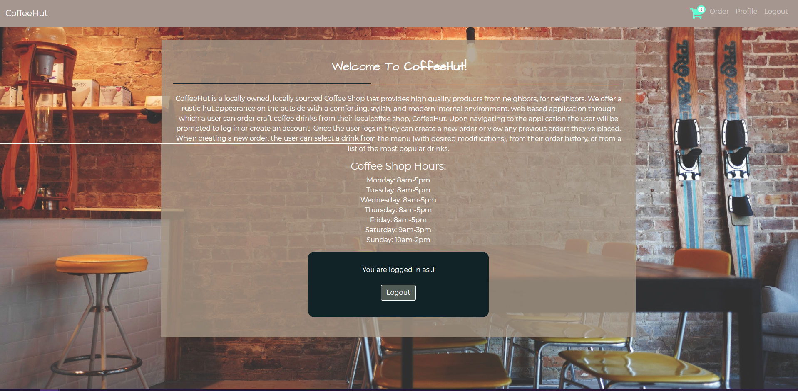
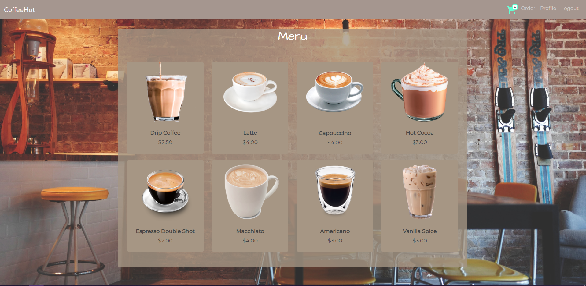
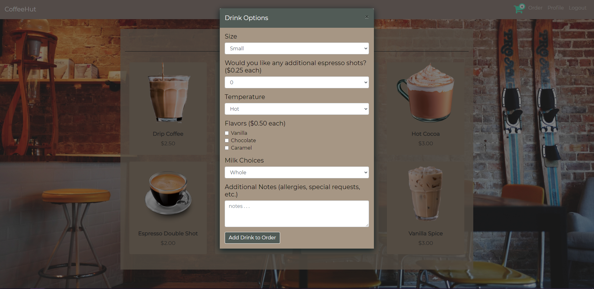
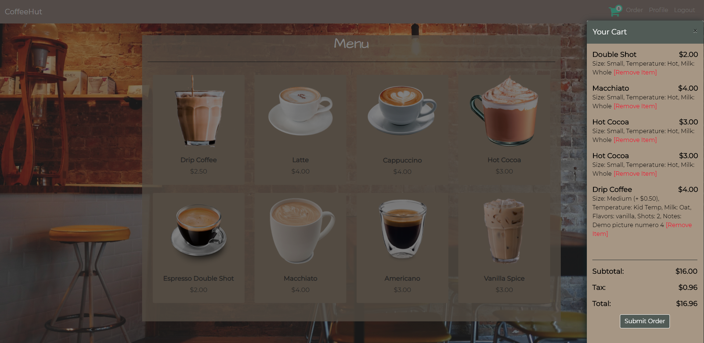
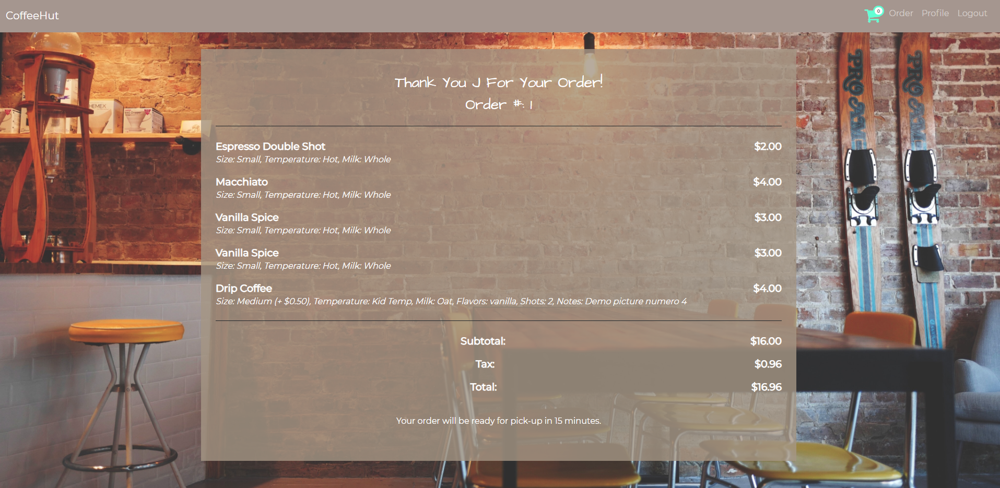
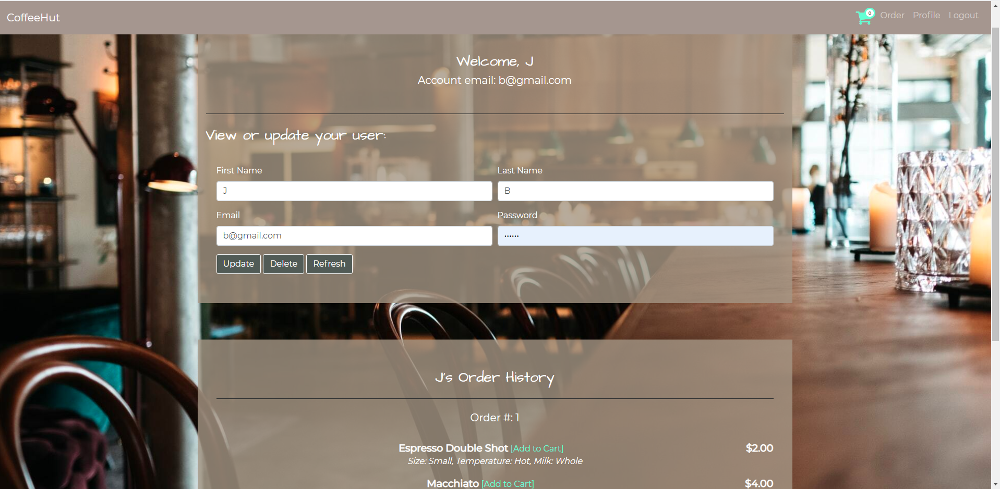

# Coffee Hut

### Live link: https://project-2-team-7.herokuapp.com/

CoffeeHut is a web based application through which a user can order craft coffee drinks from their local coffee shop, CoffeeHut. Upon navigating to the application the user will be prompted to log in or create an account. Once the user logs in they can create a new order or view any previous orders they’ve placed. When creating a new order, the user can select a drink from the given menu. Each drink may be modified using a list of customizations that are offered. Users may also visit their Profile page to adjust login information and view previous orders. 

## Contributors:

### Frontend: 
Masiel Bautista & Jacob Beeson
 

### Backend:
Jesse O'Donoghue & Graham Dickey

## Demo:

 Front page, which includes an About Me, along with a confirmation card detailing if you are logged in. This card also displays if the user entered an incorrect email or if the user is not logged in.

Order Screen, where the user may select from the given options. The options are pulled from a MySQL database, and upon adding an item to the cart, the number within the Cart Icon on the Navigation bar is updated to depict the number of items within the cart. Future development would include an Admin only page, where the developer can dynamically add/remove menu items to the Database, which would update the Order Screen to include all options that are held within the MySQL database.

The card below shows options the user may pick from to customize their drink. The card is a modal the overlays the interface. Upon clicking the "Add Drink to Order" button, the item will be added to the Cart and the modal will close. When the modal closes, the order cart modal will open on the right side of the screen, as is shown in the next image.

The image below depicts the Order Cart Modal. This modal includes all drinks that have been added to the user's order, the price of each drink including additional customization, and the order total with included tax. This modal also includes a "remove item" feature beside each added drink incase the user would like to delete an item. Future development would modify the modal into a div that would not overlay over the entire interface. The updated div would remain open, allowing the user to open new drink cards while keeping the Order Cart up.

 Upon completing their order, the user will be taken to the Order Confirmation screen shown below. This allows the user to know that their order has been completed and is being processed. The user may see each item they selected, the modifications that have been made, the item's total price, and their order's total price. Upon completing their order, it can bee seen in the Navigation bar that the cart has been reset to include zero items. Future Development would allow the amount of time in the "Your order will be ready in x minutes" to be updated to accurately reflect how much time the order is estimated to take.

The image below shows the Profile page. On the Profile page, the user is welcomed and shown the email associated with their account. The user may update their profile information, delete their account, and refresh the page so that it accurately reflects their changes. Below this, the user is shown their order history, in case they may want to recreate a previous order or forgot what items they have ordered before. 

 Pages not displayed: Login modal, Registration page, 404 error page.

